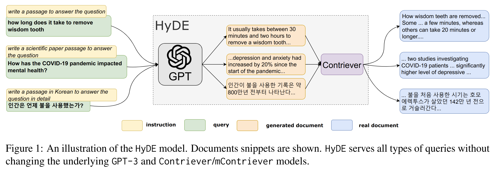

# HyDE: Precise Zero-Shot Dense Retrieval without Relevance Labels

This is code repository for the paper: [HyDE: Precise Zero-Shot Dense Retrieval without Relevance Labels](https://arxiv.org/abs/2212.10496).

**HyDE** zero-shot instructs GPT3 to generate a fictional document and re-encodes it with unsupervised retriever Contriever to search in its embedding space.
HyDE significantly outperforms Contriever across tasks and languages and it does not require any human labeled relevance judgement.



## Steps to run the code

1. Install `pyserini` by following the [guide](https://github.com/castorini/pyserini#-installation). We use pyserini to conduct dense retrieval and evaluation.


2. Download the prebuilt Contrever faiss index
```
wget  https://www.dropbox.com/s/dytqaqngaupp884/contriever_msmarco_index.tar.gz
tar -xvf contriever_msmarco_index.tar.gz
```

3. Setup GPT3 API key

```
export OPENAI = <your key>
```

4. Run `hyde-dl19.ipynb`, it will run the experiment on the TREC DL19 dataset.


## Citation

```
@article{hyde,
  title = {Precise Zero-Shot Dense Retrieval without Relevance Labels},
  author = {Luyu Gao and Xueguang Ma and Jimmy Lin and Jamie Callan},
  journal={arXiv preprint arXiv:2212.10496},
  year = {2022}
}
```